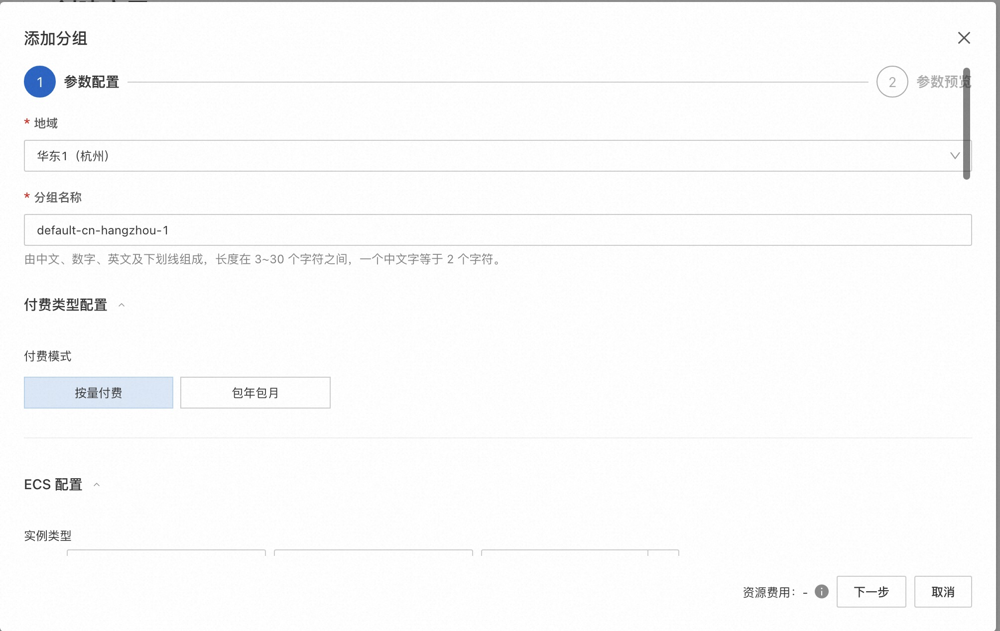
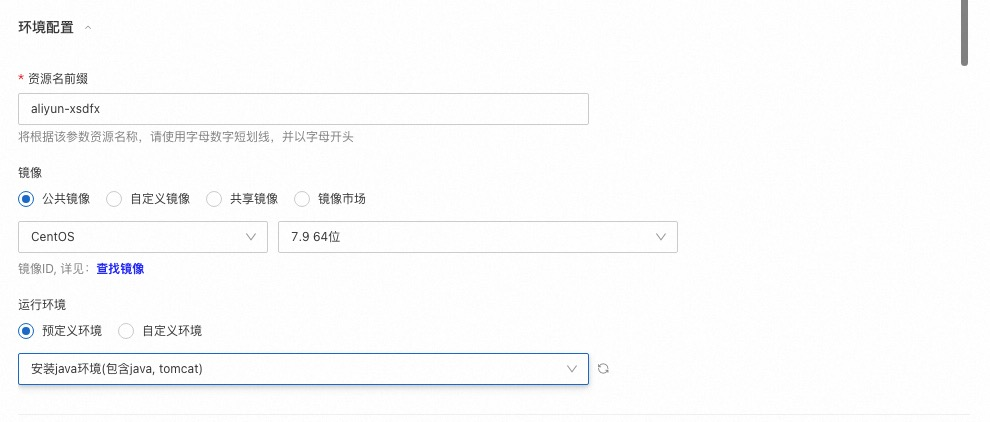
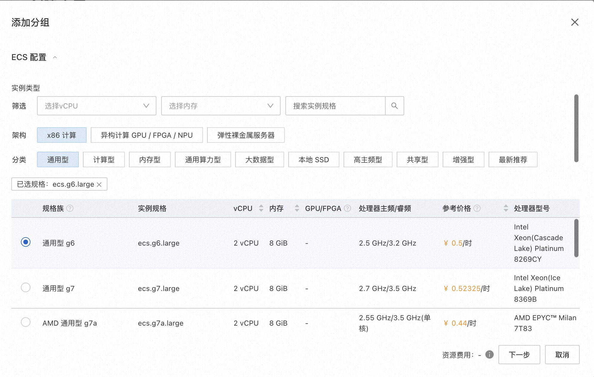
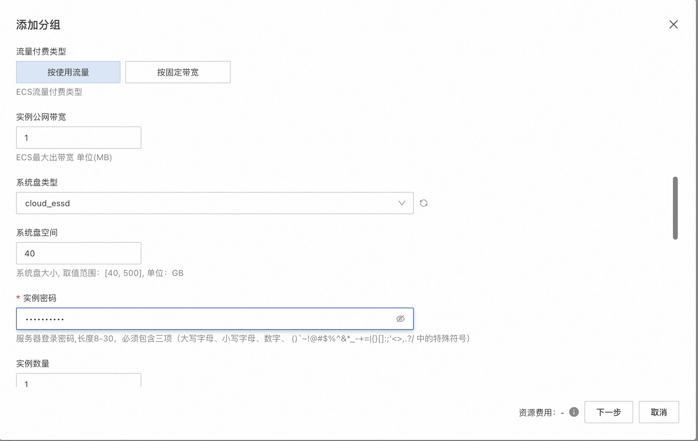
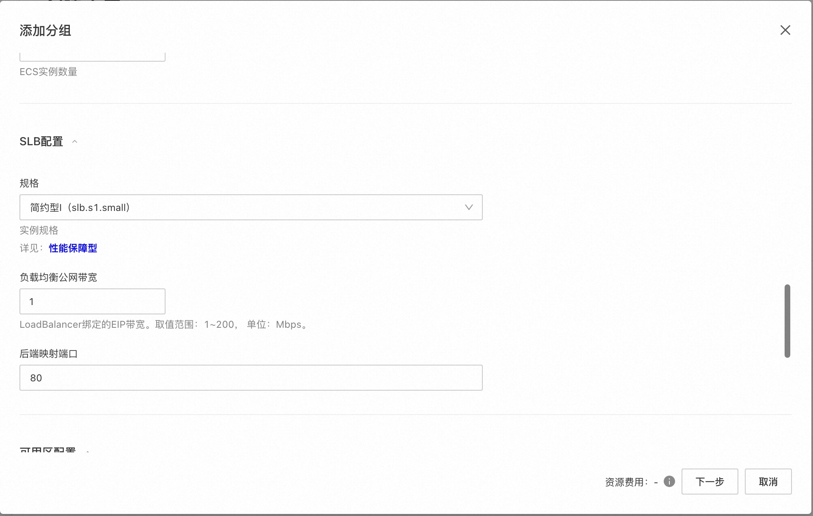
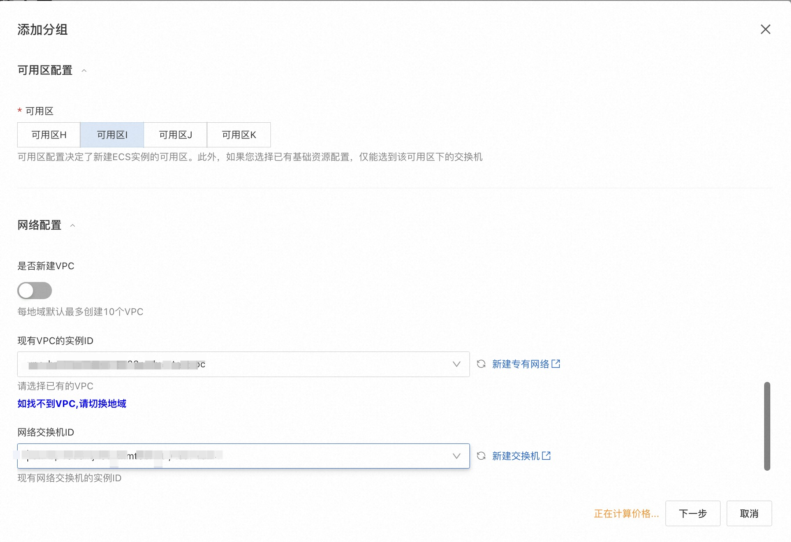
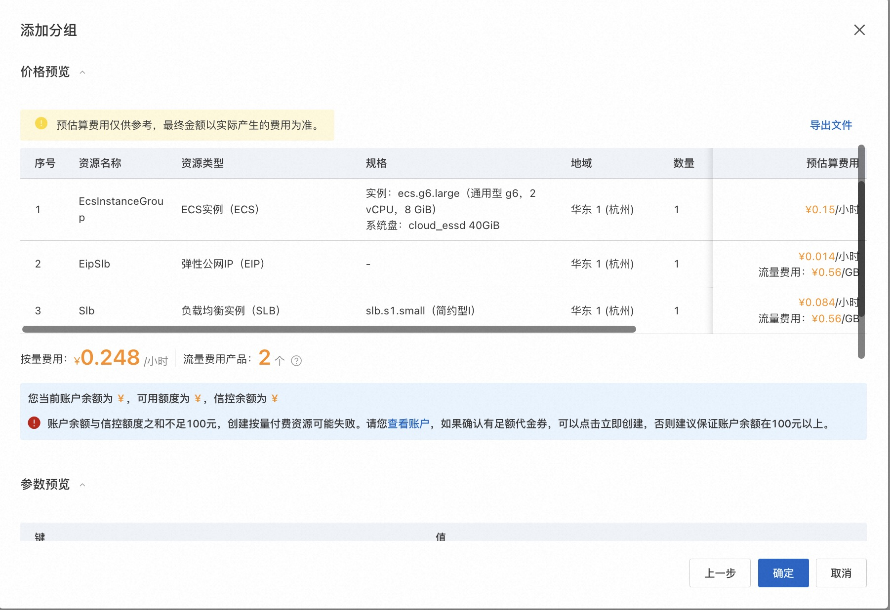
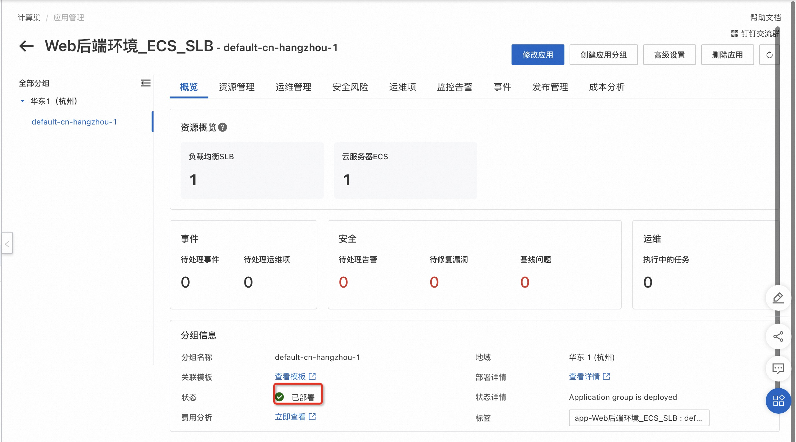
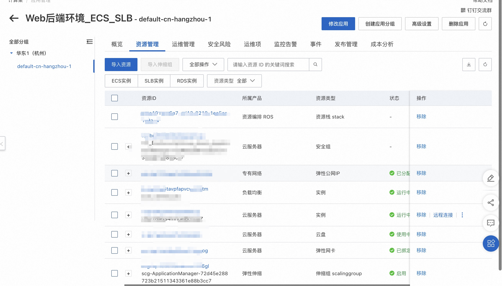

# 环境部署-创建Web后端环境(SLB+多台ECS服务器)的说明文档

## 概述

此应用模板提供了一个基于ECS弹性伸缩组和负载均衡器的Web后端环境的方案，是一种常见的生产环境高可用服务部署方式。部署此应用时， 
用户只需要输入ECS实例密码等少量参数，即可一键部署支持负载均衡和弹性伸缩的Web后端环境。

部署完成的应用分组包含一个或多个ECS实例、一个SLB实例和一个弹性伸缩组。
- ECS实例自动加入SLB后端服务器组和弹性伸缩组。
- 默认创建的弹性配置不会进行自动伸缩。
- SLB实例绑定弹性公网IP提供公网服务，ECS实例不开公网提高安全性。
- 弹性伸缩组与SLB实例关联，伸缩组中新增的实例会自动加入SLB后端服务器组，也会自动加入应用分组。

架构图如下：

待应用部署完成后，您会获得一套支持负载均衡和弹性伸缩的ECS集群环境，您可以按需求修改应用：
- 您可在创建的ECS实例中部署您的软件，推荐在"发布管理"中设置流水线，实现代码的持续集成和持续部署。
- 您可以自行修改SLB的监听配置，比如监听端口、会话保持等等。
- 您可以在应用管理的运维管理页面对伸缩组进行扩缩容，也可以将伸缩配置改为自动伸缩。
- 软件部署成功后，访问SLB实例绑定的弹性公网IP即可访问服务。

## 计费说明
部署此应用的费用主要涉及：

- 所选vCPU与内存规格
- 磁盘容量
- 公网带宽
- 所选SLB规格

计费方式包括：

- 按量付费（小时）
- 包年包月

预估费用在部署前可实时看到。

## RAM账号所需权限
若您使用RAM用户创建应用，为了使用应用管理的完整功能，需要对使用的RAM用户的账号添加相应资源的权限。添加RAM权限的详细操作，请参见[为RAM用户授权](https://help.aliyun.com/document_detail/455313.html)。

为了部署此应用，所需权限如下表所示。

| 权限策略名称 | 备注 |
| --- | --- |
| AliyunECSFullAccess | 管理云服务器服务（ECS）的权限 |
| AliyunVPCFullAccess | 管理专有网络（VPC）的权限 |
| AliyunROSFullAccess | 管理资源编排服务（ROS）的权限 |
| AliyunCloudMonitorFullAccess | 管理云监控（CloudMonitor）的权限 |
| AliyunESSFullAccess | 管理弹性伸缩服务(ESS)的权限|
| AliyunSLBFullAccess | 管理负载均衡服务（SLB）的权限|

## 部署流程
### 部署步骤
1. 访问应用管理控制台，点击“创建应用”后选择“通过模板创建”，在选择“环境部署-创建Web后端环境(SLB+多台ECS服务器)”模板，点击“使用模板”
2. 输入应用名称、应用描述后，点击“添加分组”
3. 输入部署参数，保存分组。保存前可以预览费用明细和参数。
   - 设置分组地域和分组名称，选择付费模式
     
   - 进行环境配置
     
   - 选择ECS的相关配置
     
     
   - 选择SLB的相关配置
     
   - 选择可用区和网络配置
     
   - 预览费用明细和参数
     
4. 输入应用高级设置后，点击创建

### 部署参数说明
您在创建应用分组的过程中，需要配置相关信息。下文介绍该应用模板输入参数的详细信息。

| 参数组    | 参数项         | 示例             | 说明       |
|--------|-------------|----------------|----------|
| 环境配置   | 资源名前缀类型     | 根据该前缀，设置资源名称   |
| 环境配置   | 镜像          | 资源中预先安装的镜像     |
| 环境配置   | 运行环境        | 资源中预先安装的运行环境   |
| 付费类型配置 | 付费类型        | 按量付费 或 包年包月    |
| ECS配置  | 实例类型        | ecs.g6.large   | 实例规格，可以根据实际需求选择 |
| ECS配置  | 系统盘类型       | cloud_essd     |          |
| ECS配置  | 系统盘大小       | 120GB          |          |
| ECS配置  | 实例密码        |                | 登录密码     |
| SLB配置  | 规格          | slb.s1.small   | SLB实例规格  |
| SLB配置  | 负载均衡公网带宽    | 1              | 公网带宽     |
| SLB配置  | 后端映射端口      | 80             | 后端映射端口|
| 可用区配置  | 可用区         | 杭州可用区K         |          |
| 网络配置   | 是否新建VPC     | 是              | 是否创建一个新VPC 
| 网络配置   | 专有网络IPv4网段  | 192.168.0.0/16 | VPC的ip地址段范围 |
| 网络配置   | 交换机子网网段     | 192.168.0.0/24 | 交换机子网网段  |
| 网络配置   | 现有VPC的实例ID  | vpc-xxx        |          |
| 网络配置   | 现有网络交换机ID   | vsw-xxx        |          |

### 验证结果

1. 查看应用。应用创建成功后，环境部署时间大约需要1分钟。状态变为“已部署”即为部署完成

2. 应用分组部署完成后，您可以在"资源管理"标签下看到创建的所有资源。

3. 在资源中部署好您的软件，就可以访问您自己的服务了。 注意如果您的服务使用了8080外的其他端口，需要在安全组中放开该端口的入方向访问。在资源管理中可以找到安全组，点击修改安全组规则。
